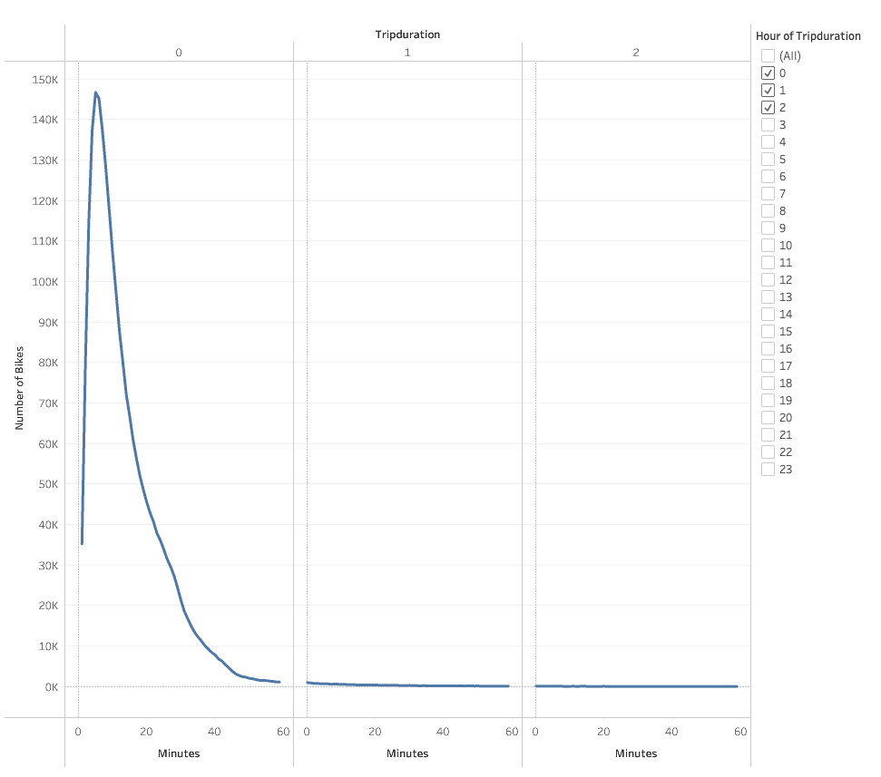
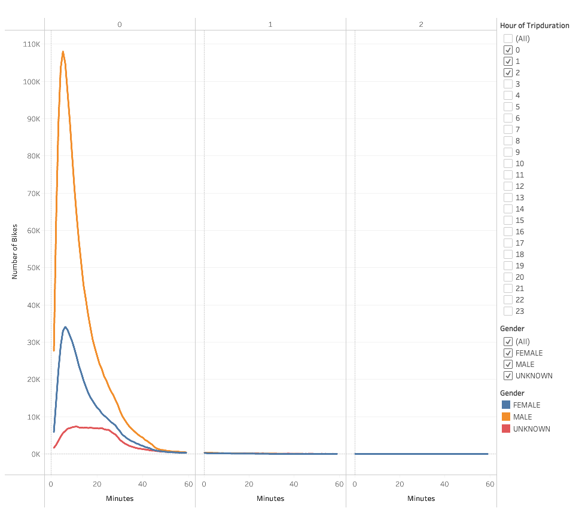
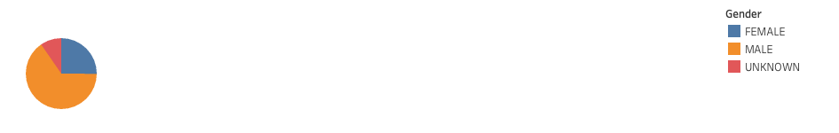
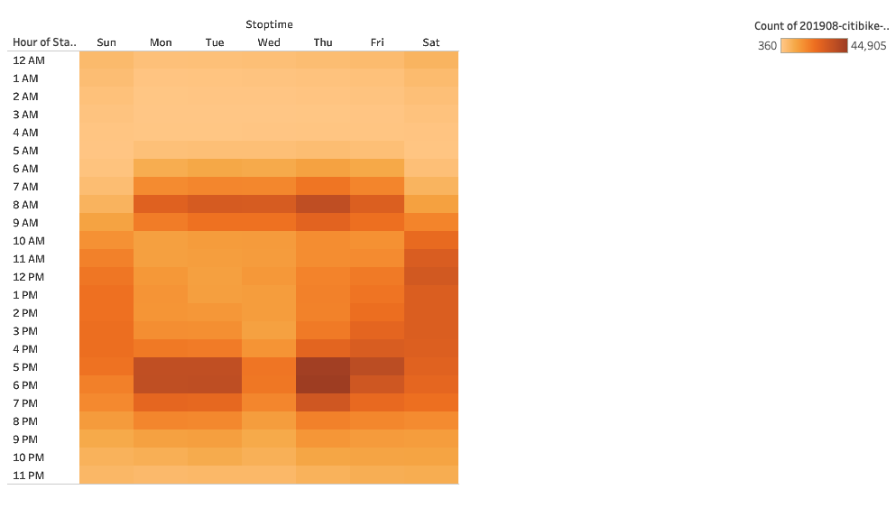
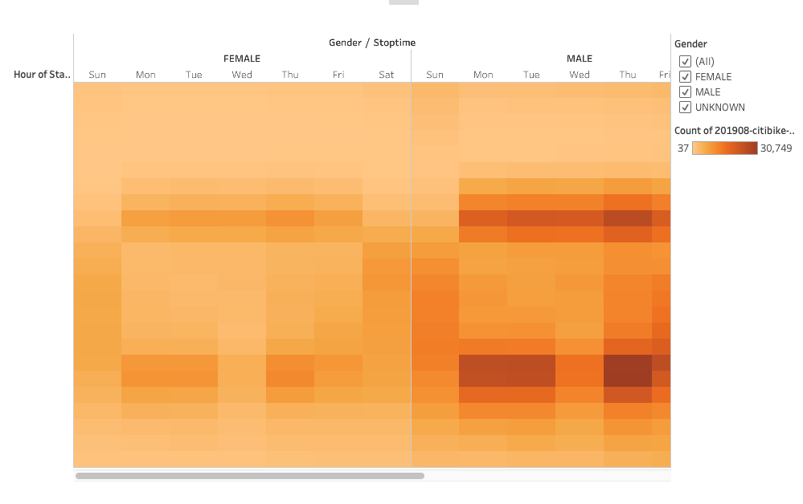
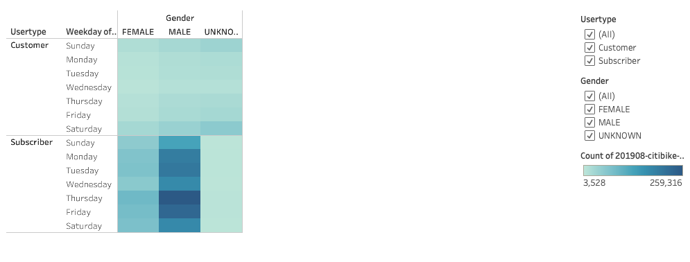
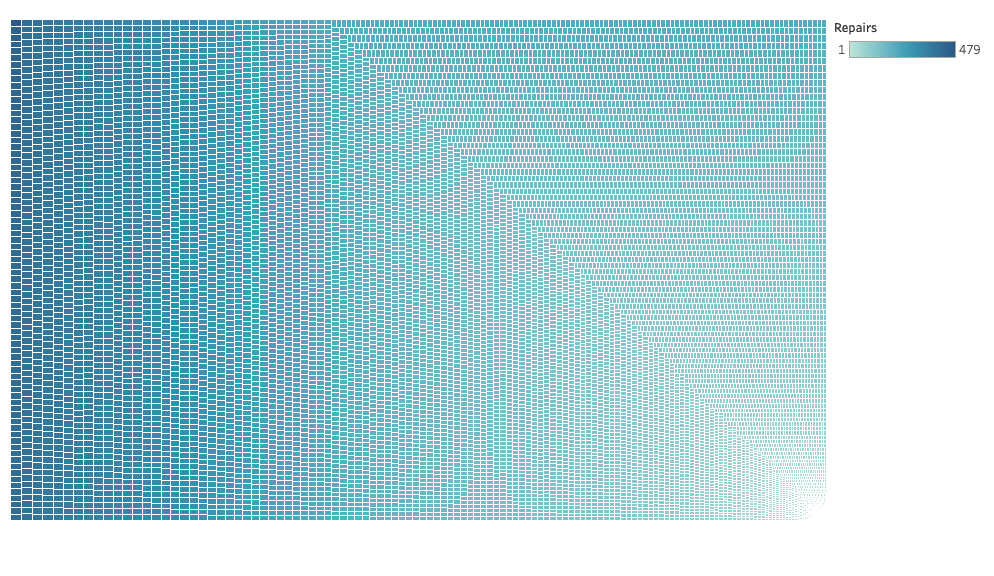

# Bikesharing
## Overview

### Purpose:
To analyze the data of the bike ride utilization in the city of New York in a visually appealling manner. The visualization will allow the creation of a business plan that will be presented to potential investors of a bike share company in Des Moines. 

## Results
There are at least seven visualizations for the NYC Citibike analysis (7 pt)
There is a description of the results for each visualization (7 pt)

Graphic Display represents the length of time that bikes are checked out for all riders
 

Graphic Display represents the length of time that bikes are checked out for each gender
 

Below is a representation of the overal gender breakdown of users
 

This image represents the number of bike trips by weekday for each hour of the day as a heatmap. The darker the color, the more bike trips occurred
 

This image displays the number of bike trips by gender for each hour of each day of the week as a heatmap. Males tend to use bikes more overall. The morning and evening hours are darker, possibly hinting that the bikes are used for commuting to and from work. 
 

This graphic display represents the number of bike trips by gender for each hour for each day of the week as a heatmap and by user type.
 

This is an image of the trip duration for each bike id. This gives us information about which bikes might be due soon for repairs based on the amount of usage. When hovering over the actual graph the bike id is provided.
 

## Summary: 

### Summary of the results
Based on the results, it appears that:
1- Males are the primary bike users.
2- Morning, evening and weekends are the busiest overall and across genders.
3- Males are more likely to become subscribers.
4- Bike usage varies per each bike and rotating or fixing the bikes can be a staggered process.

Two additional recommendations for visualizations would be to include cost data. Investors would be interested in learning about the cost and the profit of this type of business. Additional data in logistics would also be helpful.  For example, in the areas where bikes are used more often what types of business are around? Is parking an issue or are bus routes limited?

